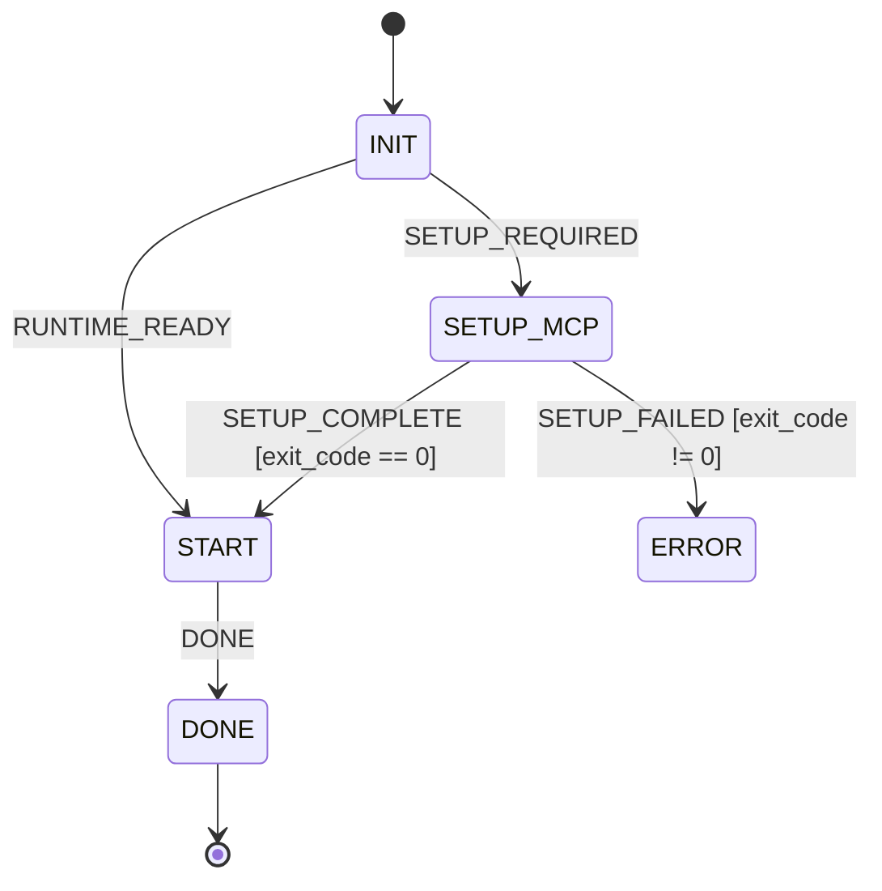

# ⚡ Reactive Skills Architecture (RSA)

> **Event-Driven Hierarchical State Machine Engine and Immutable Event Store for Agentic Skills**

[](https://github.com/Reactive-Skills/reactive-skills/actions/workflows/ci.yml)
[](https://www.gnu.org/licenses/agpl-3.0)
[](https://www.npmjs.com/package/@reactive-skills/axi)
[](https://github.com/Reactive-Skills/reactive-skills/releases/tag/v0.8.4)

---

> 🚀 **What's New in v0.8.5:**
> - automatic telemetry broker port fallback with explicit-port compatibility
> - read-only multi-job, multi-skill telemetry broker and site dashboard
> - job-targeted live telemetry with SQLite tailing
> - automatic telemetry viewer port selection with strict explicit port overrides
> - **Environment-Scoped Isolation (`REACTIVE_JOB_ID`):** Parallel subagent swarms and CI workers run isolated jobs concurrently without mutating or fighting over the shared filesystem pointer.
> - **Inverted Bootloader Contract:** `invoke` is now the primary task inception command across universal reactive bootloaders, with `state` reserved for resuming active tasks.
> - **CLI Ergonomics & Flag Synonyms:** Added `--run` and `--run-id` everywhere alongside `--job`.
>
> [Read Full Release Notes →](https://github.com/Reactive-Skills/reactive-skills/releases/tag/v0.8.4) · [View Changelog](CHANGELOG.md)

---

## 🌟 What is Reactive Skills?

Conventional agent skills are static markdown instruction files (`SKILL.md`). An LLM reads all instructions upfront, enters an unstructured execution loop, and guesses its next steps without state verification or deterministic progress guarantees.

**Reactive Skills** upgrade passive agent skills into **Hierarchical State Machines (HSM)** driven by a reactive **Event/Signal Bus**:

1. **Just-In-Time Prompt Slices:** Only the prompt, constraints, and tool whitelists for the *active state* are loaded into the LLM turn (~70% token reduction).
2. **Signal-Driven Ingress:** Transitions are triggered by typed runtime signals (`REQUIREMENTS_GATHERED`, `TESTS_PASSED`, `USER_APPROVED`).
3. **Deterministic Guard Gates:** Progress requires deterministic programmatic invariants to evaluate `true` (preventing hallucinated completion).
4. **Event Sourcing & Live Deliverables:** Every transition is recorded to an append-only ledger (`events.jsonl` + SQLite `events.db`). Documentation, PR bodies, and review matrices are live read-model projections rendered from the event stream.

---

## 📦 Packages

This repository is a monorepo containing:

- **`@reactive-skills/runtime`**: The core TypeScript statechart engine, SQLite event store driver, guard evaluator, and stdio MCP server.
- **`@reactive-skills/axi`**: The [Agent eXperience Interface (AXI)](http://axi.md) CLI (`reactive-skills-axi`) providing human- and agent-ergonomic state inspection and signal dispatch in TOON format.

---

## 🚀 Quickstart

### 1. Execution Options

You can execute commands on-demand via **`npx`** (zero installation required) or install the CLI globally:

```bash
# Zero install — works immediately for any agent or shell:
npx -y @reactive-skills/axi state <skill-name>
npx -y @reactive-skills/axi emit <skill-name> <signal-name>

# Optional: Install globally for instant local commands (`reactive-skills-axi` or `axi`):
npm install -g @reactive-skills/axi
```

### 2. Inspect a Skill's Current State

```bash
npx -y @reactive-skills/axi state <skill-name>
```

Outputs the current state, active prompt instructions, allowed tools, and available transitions in structured format:

```yaml
state:
  skill_id: my-skill
  current_state: STEP_ONE
prompt:
  raw_prompt: "# State: Processing Step One ..."
  allowed_tools: "view_file,grep_search,find_by_name,ask_question"
help[2]:
  Read the state prompt above and execute the instructed tasks
  Run `npx -y @reactive-skills/axi emit <skill> <signal>` to advance
```

### 3. Emit a Signal to Advance

```bash
npx -y @reactive-skills/axi emit <skill-name> <signal-name> [--payload '{"exit_code":0}']
```

The state machine evaluates transition guards, appends to the immutable event ledger, updates deliverables, and outputs the next state instructions.

---

## 🔌 Integration Modes

Reactive skills can be driven through two primary integration paths:

1. **AXI CLI (Universal Shell Mode):** Any agent capable of running terminal commands can drive the skill using `npx -y @reactive-skills/axi state <skill>` (or `reactive-skills-axi state <skill>`) and `npx -y @reactive-skills/axi emit <skill> <signal>`.
2. **MCP Server (Model Context Protocol):** Exposes `reactive_state` and `reactive_emit_signal` tools over stdio for Claude Desktop, Antigravity, Cursor, and any MCP-compatible harness:
   ```bash
   npx -y @reactive-skills/axi mcp
   ```

---

## 🛠️ CLI Reference

> **Note:** Commands below are shown using the zero-install `npx -y @reactive-skills/axi` prefix. If installed globally (`npm install -g @reactive-skills/axi`), you can substitute `reactive-skills-axi` or `axi`.

| Command | Usage | Description |
| :--- | :--- | :--- |
| `state` | `npx -y @reactive-skills/axi state <skill>` | Display current active state, unabridged prompt slice, and allowed tools |
| `emit` | `npx -y @reactive-skills/axi emit <skill> <signal>` | Emit a signal to evaluate guards and advance to the next state |
| `invoke` | `npx -y @reactive-skills/axi invoke <skill> [--payload JSON]` | Initialize and start a skill run |
| `events` | `npx -y @reactive-skills/axi events <skill> [limit]` | Tail recent events from the append-only event store |
| `inspect` | `npx -y @reactive-skills/axi inspect <skill>` | Print statechart topology, substates, and guard rules |
| `validate` | `npx -y @reactive-skills/axi validate [path]` | Validate skill manifest, prompt templates, transition targets, and bootloader |
| `init` | `npx -y @reactive-skills/axi init <name>` | Scaffold a new modular reactive skill package |
| `reset` | `npx -y @reactive-skills/axi reset <skill>` | Clear execution run state while preserving deliverables |
| `jobs` | `npx -y @reactive-skills/axi jobs <skill> [list\|switch\|archive]` | Inspect, switch, and archive isolated execution runs and deliverables |
| `view` | `npx -y @reactive-skills/axi view <skill>` | Launch real-time telemetry server and live visual statechart viewer |
| `dashboard` | `npx -y @reactive-skills/axi dashboard [--host <host>] [--port <port>]` | Launch one read-only broker for multi-job telemetry |
| `sync` | `npx -y @reactive-skills/axi sync [skill]` | Synchronize skills across authoring workspaces and agent satellites via zero-drift junctions |

---

## 🛠️ Authoring Reactive Skills

Avoid manually hand-authoring reactive skill packages from scratch. A reactive skill binds together statechart topology (`skill.yaml`), individual state prompt templates (`states/*.md`), deterministic guards (`guards/`), projection deliverables (`templates/*.hbs`), and strict execution bootloaders. Hand-authoring these files easily introduces syntax drift, broken transitions, or missing guards.

### Recommended: Use the `skill-manager` Skill

The canonical method to scaffold, modify, and migrate reactive skills is the **`skill-manager`** agent skill.

Instead of writing YAML manifests manually, ask your AI agent:

```text
"Use skill-manager to create a reactive skill named my-feature-workflow"
```

The `skill-manager` skill validates schemas, coordinates state prompts with strict execution invariants, and handles lifecycle operations (CREATE, UPDATE, MIGRATE_LEGACY, MIGRATE_REACTIVE).

### Visual Statecharts with `STATECHART.md`

`skill-manager` supports and generates a `STATECHART.md` alongside `skill.yaml`. This document contains a Mermaid `stateDiagram-v2` visualization of the entire state machine:



- **Visual-first design:** You can sketch a proposed state machine using a Mermaid `stateDiagram-v2` block in `STATECHART.md`, and `skill-manager` will parse it into the corresponding `skill.yaml` and state templates.
- **Continuous synchronization:** When modifying a skill's states or transitions, `skill-manager` updates both `skill.yaml` and `STATECHART.md` to keep documentation and runtime contracts identical.

### Terminal Scaffolding (`init`)

For quick command-line scaffolding, you can also use the AXI CLI:

```bash
npx -y @reactive-skills/axi init <skill-name>
```

This scaffolds the modular file layout in `skills/<skill-name>/`:

```text
skills/<skill-name>/
├── skill.yaml            # Statechart manifest (states, transitions, guards)
├── STATECHART.md         # Visual Mermaid statechart diagram
├── SKILL.md              # Skill entry point with reactive bootloader
├── states/               # State-specific markdown prompt templates
│   ├── init.md
│   ├── setup_mcp.md
│   ├── start.md
│   ├── done.md
│   └── bypass_detected.md
└── skill-release.json    # Release and schema metadata
```

---

## 🔄 Syncing & Distributing Skills

When authoring reactive skills in a central repository, consumer agent environments need immediate access to the updated definitions.
Different harnesses look for skills in separate user-level directories, including `~/.claude/skills`, `~/.gemini/config/skills`, `~/.codex/skills`, `~/.devin/skills`, and `~/.agents/skills`.
Copying files manually between these folders causes immediate version drift.

Reactive Skills solves this problem with zero-drift directory junctions on Windows and symbolic links on POSIX platforms.
A junction allows consumer satellites to reference the authoritative authoring repository directly.
Edits made in your authoring repository are instantly active in every agent environment with zero synchronization latency.

### CLI Synchronization

```bash
# Synchronize all discovered skills to default satellites via directory junctions:
npx -y @reactive-skills/axi sync

# Synchronize a specific skill only:
npx -y @reactive-skills/axi sync <skill-name>

# Preview changes without modifying files:
npx -y @reactive-skills/axi sync <skill-name> --dry-run

# Force physical file copy instead of directory junctions:
npx -y @reactive-skills/axi sync <skill-name> --copy
```

### Model Context Protocol (MCP)

Agents running in GUI environments can call the native `reactive_sync` tool:

```json
{
  "skill": "my-skill",
  "link": true,
  "dryRun": false
}
```

### Safety and Backups

The synchronizer automatically discovers authoring directories from `~/.agents/sources.json` and the active repository.
Before converting any pre-existing physical directory into a directory junction, the synchronizer creates a timestamped backup under `.sync-backups/`.
Previous files are never removed without a safe backup copy.

---

## 🗂️ Job & Run Isolation (Multi-Run Management)

RSA provides multi-run isolation, allowing teams and autonomous agents to execute multiple independent runs of the same skill without event log pollution or deliverable overwrites.

### Storage Architecture

- **Isolated Event Ledgers:** Each run maintains its own scoped event ledger under `.reactive/skills/<skill>/jobs/<job-id>/` with independent `events.jsonl` and SQLite `events.db` stores.
- **Active Job Pointer:** The active run pointer is tracked at `.reactive/skills/<skill>/active_job` (defaults to `default`). All CLI commands and MCP operations target the active run unless explicitly overridden.
- **Dual-Write Deliverable Mirroring:** Projections write to `.docs/<skill>/jobs/<job-id>/` for permanent archival, and automatically mirror to the canonical `.docs/` path for the active job.
- **Template Context:** Handlebars templates receive `jobId` directly inside `ProjectionContext`, enabling deliverables to reference their run ID.

### CLI Run Management

```bash
# Start a fresh execution run (auto-generates sortable job ID)
npx -y @reactive-skills/axi invoke <skill> [--payload JSON]

# Start an isolated named run (does not change the global active pointer)
npx -y @reactive-skills/axi invoke <skill> --job <job-id>

# Inspect or resume the active execution run (auto-rotates if prior job is terminal)
npx -y @reactive-skills/axi state <skill>

# Run with environment-scoped isolation (parallel subagents)
REACTIVE_JOB_ID=subagent-1 npx -y @reactive-skills/axi state <skill>

# List all execution runs for a skill (active job highlighted)
npx -y @reactive-skills/axi jobs <skill> list
# (or bidirectional syntax: npx -y @reactive-skills/axi jobs list <skill>)

# Switch the active execution run
npx -y @reactive-skills/axi jobs <skill> switch <job-id>

# Archive a completed run
npx -y @reactive-skills/axi jobs <skill> archive <job-id>

# Target a specific job explicitly without switching active pointer
npx -y @reactive-skills/axi state <skill> --job <job-id>
npx -y @reactive-skills/axi emit <skill> <signal> --job <job-id>
```

### Model Context Protocol (MCP) Tools

When interacting with agents over MCP, job operations are exposed as native tools:
- `reactive_list_jobs`: Lists all runs for a skill with state and active indicators.
- `reactive_switch_job`: Switches the active job pointer.
- `reactive_archive_job`: Marks a job run as archived.

---

## 📊 Telemetry & Performance Metrics

RSA provides real-time performance instrumentation and token economy tracking with zero runtime latency tax.

### Inspecting Metrics from the Event Ledger

Every state transition records execution telemetry inside `.reactive/skills/<skill>/events.jsonl`:

```json
{
  "type": "STATE_TRANSITION",
  "payload": {
    "from": "RED_SPEC",
    "to": "GREEN_CODE",
    "metrics": {
      "transition_duration_ms": 1.151,
      "slice_duration_ms": 0.922,
      "slice_tokens_est": 282
    }
  }
}
```

Tail latest transition metrics from your terminal:

```bash
# PowerShell
Get-Content .reactive/skills/<skill>/events.jsonl | ConvertFrom-Json | Where-Object { $_.type -eq "STATE_TRANSITION" } | Select-Object -ExpandProperty payload | Select-Object from, to, metrics

# SQLite
sqlite3 .reactive/skills/<skill>/events.db "SELECT seq, json_extract(payload, '$.metrics') FROM events WHERE type = 'STATE_TRANSITION';"
```

### Real-Time Telemetry Dashboard

Launch the existing single-job viewer and SSE event stream:

```bash
npx -y @reactive-skills/axi view <skill-name>                  # prefer 4242, then try the bounded fallback range
npx -y @reactive-skills/axi view <skill-name> --port 5000     # bind only to 5000
npx -y @reactive-skills/axi view <skill-name> --port 0        # ask the OS for an ephemeral port
npx -y @reactive-skills/axi view <skill-name> --job sprint-1  # follow one job without changing the active pointer
```

Launch the read-only multi-job broker:

```bash
npx -y @reactive-skills/axi dashboard
npx -y @reactive-skills/axi dashboard --port 0
npx -y @reactive-skills/axi dashboard --host 0.0.0.0 --port 4500
```

The command reports the actual listener URL and bound port.

Open the site `/telemetry` route and enter that broker URL in the connection field.

The broker catalog discovers skills and jobs from the current workspace's `.reactive/skills` directory and returns skill names, job IDs, status, current HSM state, local latest sequence, update time, and active-job metadata.

The dashboard uses `GET /catalog`, job-scoped `GET /state?skillId=<skill-id>&jobId=<job-id>`, and one filtered `GET /events` SSE connection for all tracked targets.

Add two jobs from the catalog, such as `jsm-workflow/review-slice` and `jsm-workflow/test-slice`, to monitor them simultaneously.

Every card verifies both skill ID and job ID before accepting an event, so a signal written to one job cannot update another card.

The broker tails each job's SQLite event store and refreshes the catalog on a bounded interval, so new jobs and cross-process events appear without restarting it.

The broker is read-only telemetry.

It does not dispatch signals, write events, change the active-job pointer, or scan arbitrary browser localhost ports.

The existing `view <skill> --job <job-id>` command remains single-job scoped for explicit isolation and backward compatibility.

The broker keeps the existing CORS and Local Network Access response headers so a site served from another origin can request local telemetry after the browser grants access.

See [the telemetry guide](apps/site/src/infrastructure/content/docs/telemetry.js) for endpoint details and a two-job walkthrough.

When `--port` is omitted, the viewer first attempts `127.0.0.1:4242` and then tries the next available port in a bounded deterministic range.

The CLI output, telemetry URLs, `/health`, `/state`, and SSE connection metadata report the actual selected port.

An explicit `--port` is strict, so an occupied port returns an error instead of falling back.

The browser viewer does not scan local ports automatically.

For performance tiers, algorithmic budgets, and caching standards, see [PERFORMANCE-STANDARDS.md](PERFORMANCE-STANDARDS.md).

---

## 📜 License

The core Reactive Skills framework (`@reactive-skills/runtime` and `@reactive-skills/axi`) is licensed under the **GNU Affero General Public License v3.0 (AGPL-3.0)**. See [LICENSE](LICENSE) for details.

Reactive skills created using the Reactive Skills Architecture (e.g. in community skill repositories or third-party agents) may be licensed independently under permissive licenses such as MIT.

