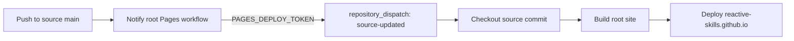

# Site and CMS Maintenance

This runbook describes how the Reactive Skills documentation site is authored, deployed, and recovered.

## Repository ownership

The source repository is [`Reactive-Skills/reactive-skills`](https://github.com/Reactive-Skills/reactive-skills).

It owns the site application under `apps/site`, blog content under `content/blog`, and Decap CMS configuration under `apps/site/public/admin/config.yml`.

The root Pages repository is [`Reactive-Skills/Reactive-Skills.github.io`](https://github.com/Reactive-Skills/Reactive-Skills.github.io).

It owns the GitHub Pages deployment workflow and does not contain the site source.

## Automatic deployment

Changes pushed to `main` in the site, blog content, workspace manifests, or the notifier workflow start the [root Pages notification workflow](https://github.com/Reactive-Skills/reactive-skills/actions/workflows/notify-pages.yml).

The notifier sends a `source-updated` repository dispatch event to the root Pages repository.

The event includes the source commit so the root workflow builds the exact revision that changed the site.

The root Pages workflow checks out that source commit, builds the site with root-site mode enabled, uploads `apps/site/out`, and deploys it to [`https://reactive-skills.github.io/`](https://reactive-skills.github.io/).

The [root Pages workflow](https://github.com/Reactive-Skills/Reactive-Skills.github.io/actions/workflows/deploy.yml) is the deployment source of truth.

## Deployment secret

`PAGES_DEPLOY_TOKEN` must be configured as a repository secret in `Reactive-Skills/reactive-skills`.

The source workflow reads this secret to authenticate the repository dispatch request.

The root Pages repository does not need a copy of this secret.

If the token is rotated or expires, update the source repository secret without changing the workflow name.

Do not print or commit the token value.

## Manual deployment fallback

If `PAGES_DEPLOY_TOKEN` is absent, the notifier reports that the root deployment remains manual.

Open the [root Pages workflow](https://github.com/Reactive-Skills/Reactive-Skills.github.io/actions/workflows/deploy.yml) and select **Run workflow**.

Use `main` as `source_ref` unless a specific source commit or branch needs to be deployed.

The source repository still contains the legacy [project Pages workflow](https://github.com/Reactive-Skills/reactive-skills/actions/workflows/deploy-pages.yml) as a compatibility and rollback path.

## CMS maintenance

Production CMS access is available at [`https://reactive-skills.github.io/admin/`](https://reactive-skills.github.io/admin/).

Decap CMS is configured to write to the `main` branch of `Reactive-Skills/reactive-skills`.

Blog entries are stored in `content/blog` and site media is stored under `apps/site/public/images/blog`.

A CMS commit that changes `content/blog` automatically starts the root Pages deployment flow.

For local authoring, run `pnpm dev:cms` from the repository root.

The local CMS backend is enabled by `apps/site/public/admin/config.yml`.

## Compatibility and rollback

The site supports both root-site mode and the legacy project base path.

The current production URL is [`https://reactive-skills.github.io/`](https://reactive-skills.github.io/).

The legacy project URL remains available at [`https://reactive-skills.github.io/reactive-skills/`](https://reactive-skills.github.io/reactive-skills/).

Keep the legacy workflow and base-path fallback until the root deployment has completed an intentional deprecation period.

When investigating a root deployment failure, first run the root Pages workflow manually from the source commit that should be published.

Use the legacy project URL as a comparison point while diagnosing path, asset, or metadata differences.

## Post-deployment smoke checks

After a deployment, verify the home page, `/admin/`, `/sitemap.xml`, `/robots.txt`, and one blog page.

Confirm that navigation, canonical URLs, RSS links, and sitemap entries use the root URL.

Confirm that the CMS still targets `Reactive-Skills/reactive-skills`.

## Related source files

- [Root Pages notifier](../../.github/workflows/notify-pages.yml)
- [Legacy project Pages workflow](../../.github/workflows/deploy-pages.yml)
- [CMS configuration](../../apps/site/public/admin/config.yml)
- [Site base-path configuration](../../apps/site/next.config.mjs)
- [Site metadata configuration](../../apps/site/src/infrastructure/siteMetadata.js)
