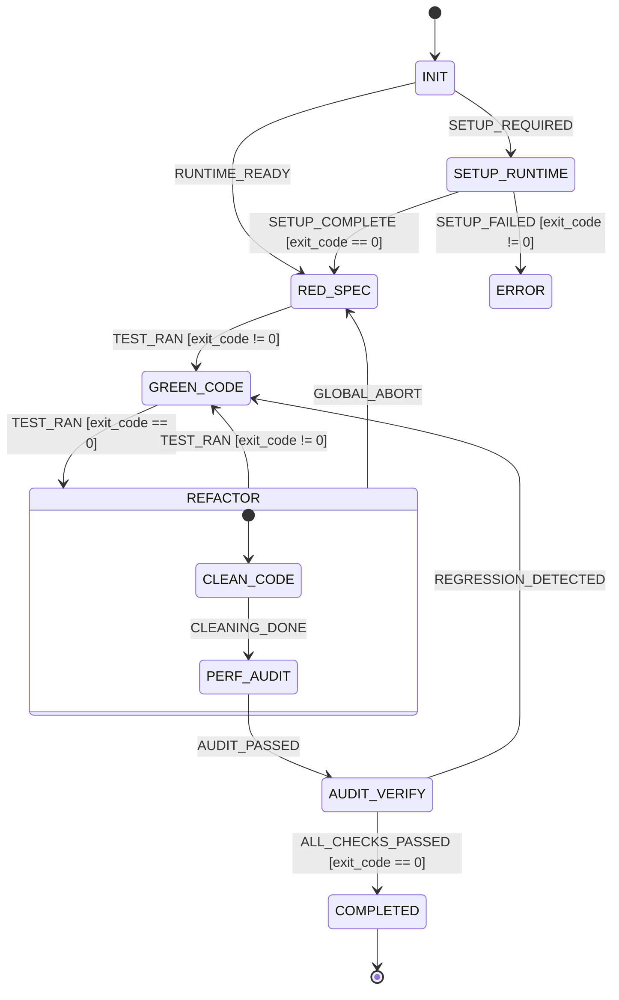

# Statechart: test-fsm

```mermaid
stateDiagram-v2
    [*] --> INIT
    INIT --> RED_SPEC : RUNTIME_READY
    INIT --> SETUP_RUNTIME : SETUP_REQUIRED

    SETUP_RUNTIME --> RED_SPEC : SETUP_COMPLETE [exit_code == 0]
    SETUP_RUNTIME --> ERROR : SETUP_FAILED [exit_code != 0]

    RED_SPEC --> GREEN_CODE : TEST_RAN [exit_code != 0]

    GREEN_CODE --> REFACTOR : TEST_RAN [exit_code == 0]

    state REFACTOR {
        [*] --> CLEAN_CODE
        CLEAN_CODE --> PERF_AUDIT : CLEANING_DONE
    }

    REFACTOR --> GREEN_CODE : TEST_RAN [exit_code != 0]
    REFACTOR --> RED_SPEC : GLOBAL_ABORT
    PERF_AUDIT --> AUDIT_VERIFY : AUDIT_PASSED

    AUDIT_VERIFY --> COMPLETED : ALL_CHECKS_PASSED [exit_code == 0]
    AUDIT_VERIFY --> GREEN_CODE : REGRESSION_DETECTED

    COMPLETED --> [*]
```
